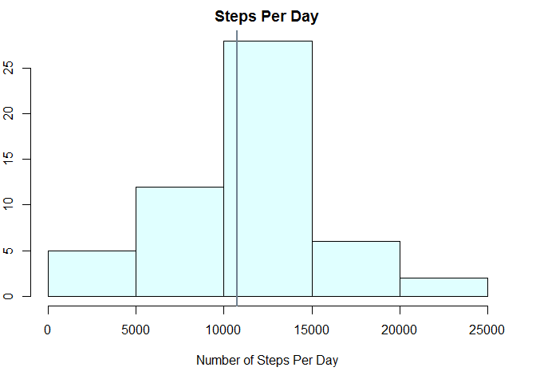
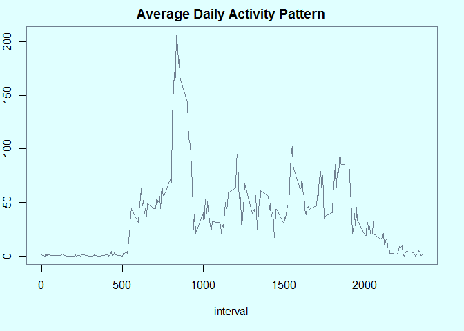
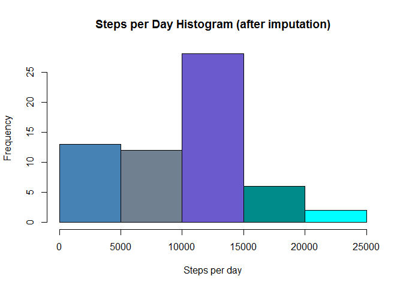
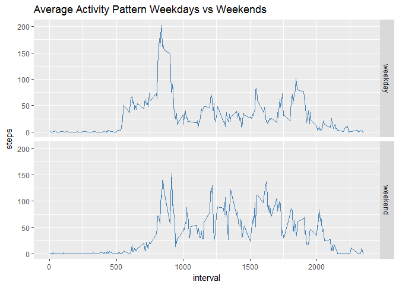

DanielleBeard  
May 16, 2017  

#Activity Monitoring Analysis
<span style="color:blue"> *Danielle Beard* </span>

<span style="color:blue"> *May 2017* </span>


##Introduction
It is now possible to collect a large amount of data about personal movement using activity monitoring devices such as a Fitbit, Nike Fuelband, or Jawbone Up. These type of devices are part of the "quantified self" movement - a group of enthusiasts who take measurements about themselves regularly to improve their health, to find patterns in their behavior, or because they are tech geeks.

This assignment makes use of data from a personal activity monitoring device. This device collects data at 5 minute intervals through out the day. The data consists of two months of data from an anonymous individual collected during the months of October and November, 2012 and include the number of steps taken in 5 minute intervals each day.

We will load, process, and explore the data in R code below. 

##Loading and Preprocessing the Data
We will load the data and check to ensure it is in an appropriate format for our analysis. The only change we need to make to the data is convert it to POSIXt format. 

Note: We need the package "lubridate" in order to convert the date. 


```r
setwd("C:/Users/579447/Desktop/Coursera/ReproducibleResearch")
activity_data <- read.csv("activity.csv")
library(lubridate)
activity_data$date <- ymd(activity_data$date)
```

##What is mean total number of steps taken per day?
We will calculate the total number of steps taken per day and plot this in a histogram.
Note: We will ignore the missing values in the dataset.


```r
steps_per_day <- aggregate(steps ~ date, data = activity_data, sum)
par(mar=c(5,2,2,2))
hist(steps_per_day$steps, col="lightcyan", xlab="Number of Steps Per Day", main="Steps Per Day")
abline(v=mean(steps_per_day$steps), col="green", lwd = 1, untf=FALSE)
abline(v=median(steps_per_day$steps), col="slategray", lwd = 2, untf=FALSE) 
```

<!-- -->

```r
mean(steps_per_day$steps)
```

```
## [1] 10766.19
```

```r
median(steps_per_day$steps)
```

```
## [1] 10765
```
Note: On the graph, the mean and median lines are so close that they are on top of one another

##What is the Average Daily Activity Pattern?
We will make a time series plot of the 5-minute interval (x-axis) and the average number of steps taken, averaged across all days (y-axis).  Then, we will answer the question: Which 5-minute interval, on average across all the days in the dataset, contains the maximum number of steps?


```r
average_steps_per_interval <- aggregate(steps ~ interval, data = activity_data, mean)
par(mar=c(5,2,2,2), bg="lightcyan", col="slategray")
plot(average_steps_per_interval, type="l", main = "Average Daily Activity Pattern")
```

<!-- -->

Now to answer our question: Which 5-minute interval, on average across all the days in the dataset, contains the maximum number of steps?


```r
average_steps_per_interval$interval[which.max(average_steps_per_interval$steps)]
```

```
## [1] 835
```

##Imputing Missing Values
Note that there are a number of days/intervals where there are missing values. The presence of missing days may introduce bias into some calculations or summaries of the data.
The first thing we will do is calculate and report the total number of missing values in the dataset (i.e. the total number of rows with NAs).

```r
sum(apply(activity_data, 1, function(row) any(is.na(row))))
```

```
## [1] 2304
```

We now create a new dataset activity_data_imputed in which we imput missing values by using a linear interpolation of closest non-NA rows:

```r
activity_data_imputed <- activity_data
activity_data_imputed$steps <- approxfun(seq_along(activity_data$steps), activity_data$steps, method="linear", rule=2)(seq_along(activity_data$steps))
if(any(is.na(activity_data_imputed))) {print("WARNING: NA values in activity_data_imputed")}
```


Now, we will make a histogram of the total number of steps taken each day and calculate and report the mean and median total number of steps taken per day. Then we will answer the questions:
1. Do these values differ from the estimates from the first part of the assignment? 
2. What is the impact of imputing missing data on the estimates of the total daily number of steps?


```r
steps_per_day_imputed <- aggregate(steps ~ date, data = activity_data_imputed, sum)
colors = c("steelblue", "slategray", "slateblue", "darkcyan", "cyan") 
hist(steps_per_day_imputed$steps, xlab="Steps per day", main="Steps per Day Histogram (after imputation)", col=colors)
```

<!-- -->

```r
mean_steps_per_day_imputed <- mean(steps_per_day_imputed$steps)
median_steps_per_day_imputed <- median(steps_per_day_imputed$steps)
mean_steps_per_day_imputed
```

```
## [1] 9354.23
```

```r
median_steps_per_day_imputed
```

```
## [1] 10395
```

To look at the non-imputed mean and median:

```r
mean(steps_per_day$steps)
```

```
## [1] 10766.19
```

```r
median(steps_per_day$steps)
```

```
## [1] 10765
```

To answer the previously stated questions:
1. We conclude that linear imputation of missing data changes the mean value of total steps per day by -1411.96. 
2. We conclude that linear imputation of missing data changes the median value of total steps per day by -370.

##Are there differences in activity patterns between weekdays and weekends?

Using the dataset with the filled in missing values, we will create a new factor variable in the dataset with two levels - "weekday" and "weekend" indicating whether a given date is a weekday or weekend day.  Then we will make a time series plot of the 5-minute interval (x-axis) and the average number of steps taken, averaged across all weekday days or weekend days (y-axis) to determine the differences in activity pattern between the two. 

First, we will create the new factor variable with two levels in the activity_data_imputed dataset. 

```r
weekorweekend <- function(date) {
    if (weekdays(date) %in% c("Saturday", "Sunday")) {"weekend"} else {"weekday"}
}
activity_data_imputed$weekorweekend <- as.factor(sapply(activity_data_imputed$date, weekorweekend))
```

Finally, we will make a panel plot containing a time series plot of the 5-minute interval and the average number of steps taken, averaged across all weekday days or weekend days.

```r
average_steps_per_interval_weekorweekday_imputed <- aggregate(steps ~ interval + weekorweekend, data = activity_data_imputed, mean)
suppressMessages(library(ggplot2))
ggplot(data = average_steps_per_interval_weekorweekday_imputed, aes(x=interval, y=steps)) + facet_grid(weekorweekend ~ .) + geom_line(color="steelblue") + ggtitle("Average Activity Pattern Weekdays vs Weekends")
```

<!-- -->

Note: We can obviously see a drastic change between weekday and weekend day activity.

##Conclusion
Using a few simple chunks of R code we've been able to process a zipped data file with human activity data and gain insight into the following questions:

What is mean total number of steps taken per day?
What is the average daily activity pattern?
How to impute missing values?
Are there differences in activity patterns between weekdays and weekends?


